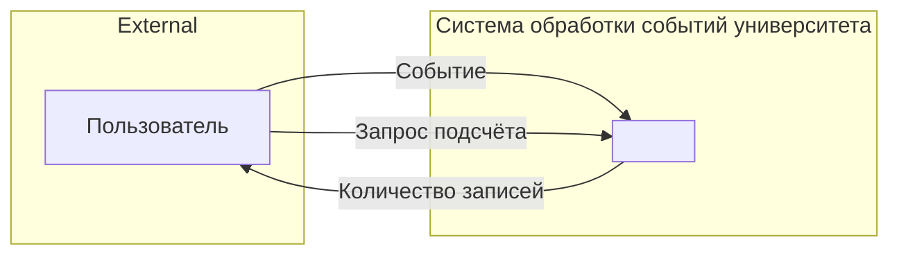
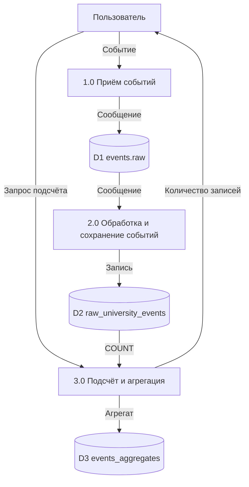
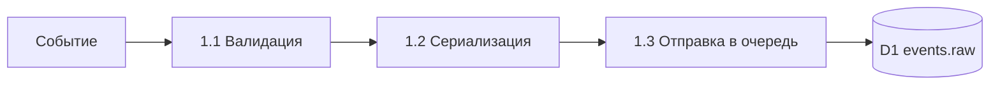
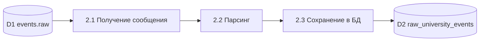
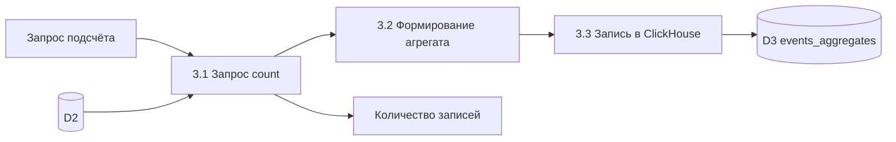

# DFD-диаграммы (нотация Гейна-Сарсона)

**Система обработки событий университета**

---

## Контекстная диаграмма (уровень 0)



| Поток | Направление | Содержание |
|-------|-------------|------------|
| Событие | Пользователь → Система | JSON с полями события (ФИО, дисциплина, аудитория, дата) |
| Запрос подсчёта | Пользователь → Система | POST /api/v1/events/count |
| Количество записей | Система → Пользователь | JSON {count: N} |

---

## Диаграмма 1 уровня



| Процесс | Входы | Выходы |
|---------|-------|--------|
| 1.0 Приём событий | Событие (REST) | D1 events.raw |
| 2.0 Обработка и сохранение | D1 events.raw | D2 raw_university_events |
| 3.0 Подсчёт и агрегация | Запрос подсчёта, D2 | D3, Количество записей |

---

## Диаграмма 2 уровня: процесс 1.0



### Мини-спецификация 1.1 Валидация
```
ВХОД: EventDto (JSON)
ВЫХОД: EventDto (валидный)
ПРОЦЕСС:
  IF id пустой THEN id := UUID()
  IF fio_prepodavatelya пусто OR disciplina пусто OR auditoriya пусто OR data_sobytiya null
    THEN REJECT (400)
  RETURN event
```

### Мини-спецификация 1.2 Сериализация
```
ВХОД: EventDto
ВЫХОД: String (JSON)
ПРОЦЕСС:
  json := ObjectMapper.writeValueAsString(event)
  RETURN json
```

### Мини-спецификация 1.3 Отправка в очередь
```
ВХОД: String (JSON)
ВЫХОД: D1
ПРОЦЕСС:
  RabbitTemplate.convertAndSend("events.raw", json)
```

---

## Диаграмма 2 уровня: процесс 2.0



### Мини-спецификация 2.1 Получение сообщения
```
ВХОД: D1 (очередь events.raw)
ВЫХОД: String
ПРОЦЕСС:
  @RabbitListener(queues = "events.raw")
  ON message RECEIVED: RETURN message.getBody()
```

### Мини-спецификация 2.2 Парсинг
```
ВХОД: String (JSON)
ВЫХОД: RawUniversityEvent
ПРОЦЕСС:
  map := ObjectMapper.readValue(message, Map)
  entity.externalId := map["id"]
  entity.fioPrepodavatelya := map["fio_prepodavatelya"]
  entity.disciplina := map["disciplina"]
  entity.auditoriya := map["auditoriya"]
  entity.dataSobytiya := parse(map["data_sobytiya"])
  RETURN entity
```

### Мини-спецификация 2.3 Сохранение в БД
```
ВХОД: RawUniversityEvent
ВЫХОД: D2
ПРОЦЕСС:
  repository.save(entity)
```

---

## Диаграмма 2 уровня: процесс 3.0



### Мини-спецификация 3.1 Запрос count
```
ВХОД: D2 (PostgreSQL)
ВЫХОД: Long, передача в 3.2 и Resp
ПРОЦЕСС:
  count := postgresRepository.count()
  RETURN count
```

### Мини-спецификация 3.2 Формирование агрегата
```
ВХОД: count (Long)
ВЫХОД: (DateTime, UInt64)
ПРОЦЕСС:
  now := LocalDateTime.now()
  RETURN (now, count)
```

### Мини-спецификация 3.3 Запись в ClickHouse
```
ВХОД: (data_vremya_zapisi, kolichestvo_zapisey)
ВЫХОД: D3
ПРОЦЕСС:
  INSERT INTO events_aggregates VALUES (now, count)
  via HTTP POST to ClickHouse
```
