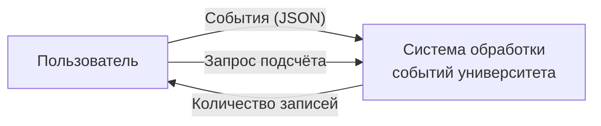
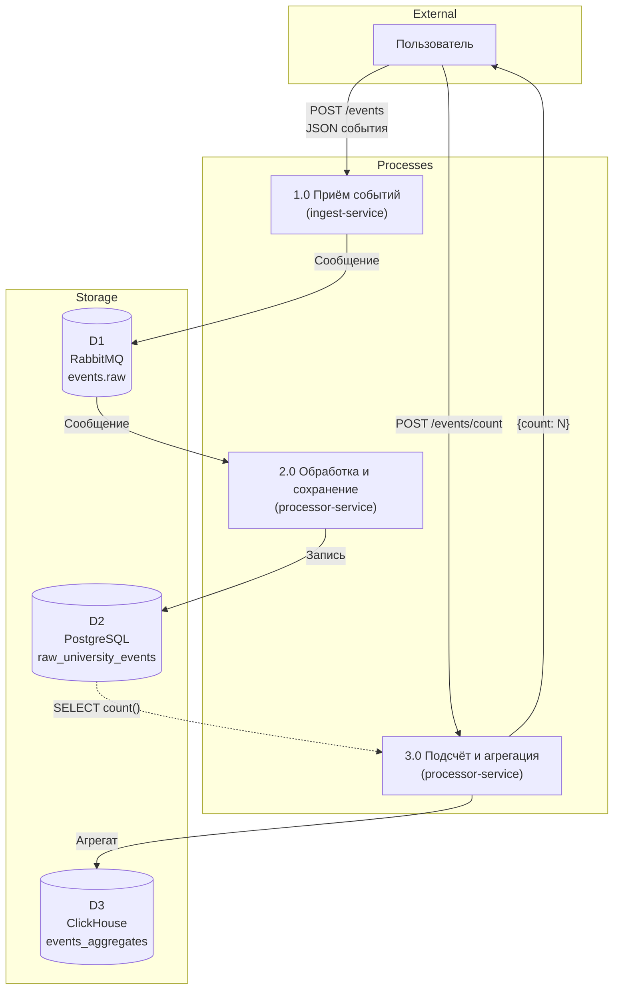
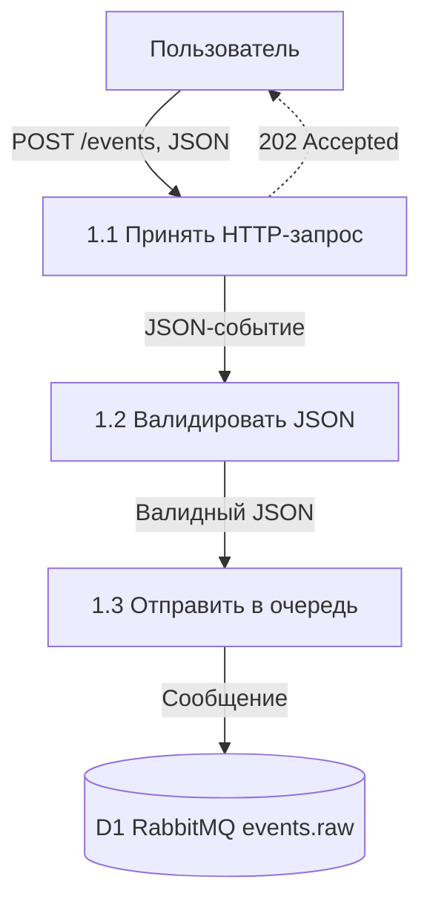
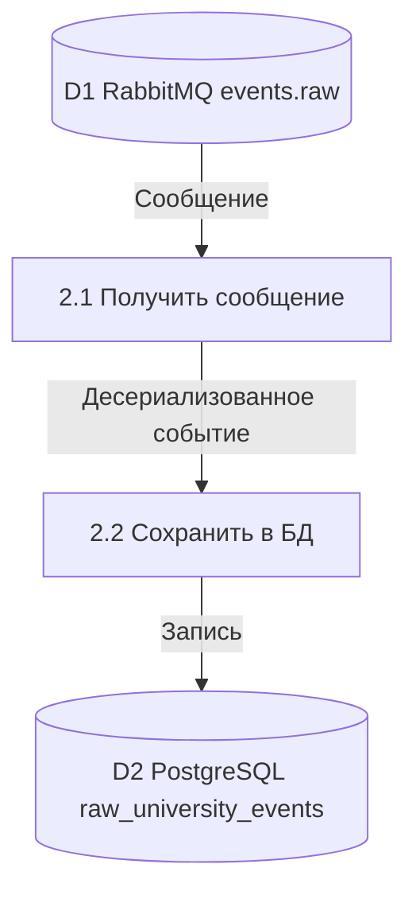
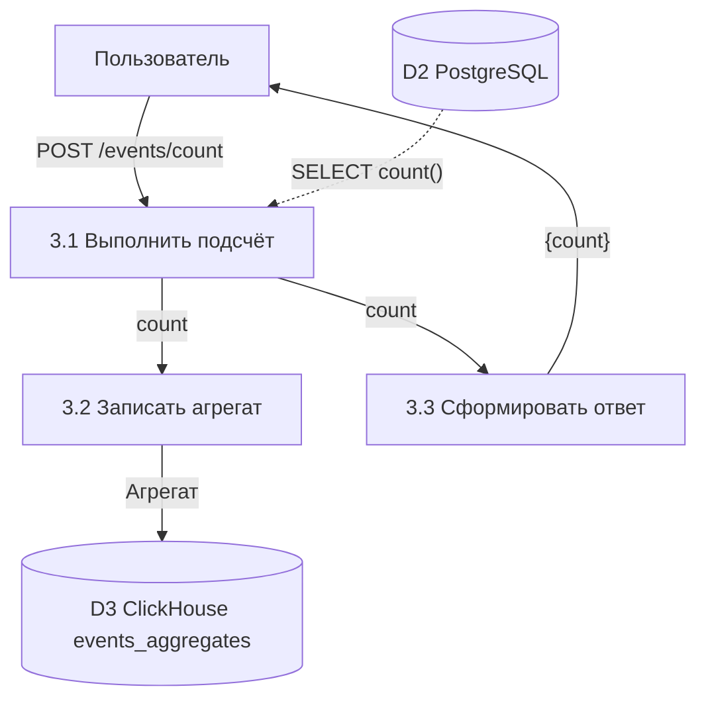

# DFD-диаграмма (нотация Гейна-Сарсона)

**Система обработки событий университета**

---

## Контекстная диаграмма (уровень 0)

---

## Диаграмма 1 уровня

**Потоки данных:**

| № | От | К | Данные |
|---|----|---|--------|
| 1 | Пользователь | 1.0 | POST /events, JSON (ФИО, дисциплина, аудитория, дата) |
| 2 | 1.0 | D1 | Сообщение в очередь RabbitMQ |
| 3 | D1 | 2.0 | Сообщение из очереди |
| 4 | 2.0 | D2 | Запись в PostgreSQL |
| 5 | Пользователь | 3.0 | POST /events/count |
| 6 | D2 | 3.0 | Запрос count в PostgreSQL |
| 7 | 3.0 | D3 | Вставка (дата, количество) в ClickHouse |
| 8 | 3.0 | Пользователь | Ответ {count} |

---

## Диаграммы 2 уровня

### Декомпозиция процесса 1.0 «Приём событий»

### Декомпозиция процесса 2.0 «Обработка и сохранение»

### Декомпозиция процесса 3.0 «Подсчёт и агрегация»

---

## Мини-спецификации (процессы 2 уровня)

### Процесс 1.1 «Принять HTTP-запрос»

| Поле | Описание |
|------|----------|
| **Вход** | POST /api/v1/events с телом JSON |
| **Выход** | JSON-событие (в процесс 1.2); HTTP 202 Accepted (клиенту) |
| **Логика** | Получить запрос, извлечь тело, проверить Content-Type. При успехе передать JSON далее; ответить 202. |

### Процесс 1.2 «Валидировать JSON»

| Поле | Описание |
|------|----------|
| **Вход** | JSON-событие |
| **Выход** | Валидный JSON (в процесс 1.3) |
| **Логика** | Проверить наличие полей fio_prepodavatelya, disciplina, auditoriya, data_sobytiya. Проверить типы и форматы. При ошибке — 400 Bad Request. |

### Процесс 1.3 «Отправить в очередь»

| Поле | Описание |
|------|----------|
| **Вход** | Валидный JSON-событие |
| **Выход** | Сообщение в D1 (RabbitMQ, events.raw) |
| **Логика** | Сериализовать JSON в сообщение, опубликовать в очередь events.raw. |

### Процесс 2.1 «Получить сообщение»

| Поле | Описание |
|------|----------|
| **Вход** | Сообщения из D1 (очередь events.raw) |
| **Выход** | Десериализованное событие (в процесс 2.2) |
| **Логика** | Подписка на очередь, получение сообщения, парсинг JSON в объект. ACK после успешной обработки. |

### Процесс 2.2 «Сохранить в БД»

| Поле | Описание |
|------|----------|
| **Вход** | Десериализованное событие |
| **Выход** | Запись в D2 (таблица raw_university_events) |
| **Логика** | INSERT в raw_university_events (fio_prepodavatelya, disciplina, auditoriya, data_sobytiya). |

### Процесс 3.1 «Выполнить подсчёт»

| Поле | Описание |
|------|----------|
| **Вход** | Запрос POST /events/count; чтение из D2 |
| **Выход** | Значение count (в процессы 3.2 и 3.3) |
| **Логика** | SELECT count(*) FROM raw_university_events. Передать результат далее. |

### Процесс 3.2 «Записать агрегат»

| Поле | Описание |
|------|----------|
| **Вход** | count от процесса 3.1 |
| **Выход** | Запись в D3 (events_aggregates) |
| **Логика** | INSERT (data_vremya_zapisi = now(), kolichestvo_zapisey = count) в ClickHouse. |

### Процесс 3.3 «Сформировать ответ»

| Поле | Описание |
|------|----------|
| **Вход** | count от процесса 3.1 |
| **Выход** | JSON {count: N} пользователю |
| **Логика** | Сериализовать в JSON, вернуть HTTP 200 с телом {"count": N}. |
