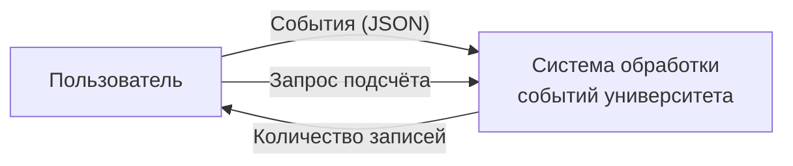
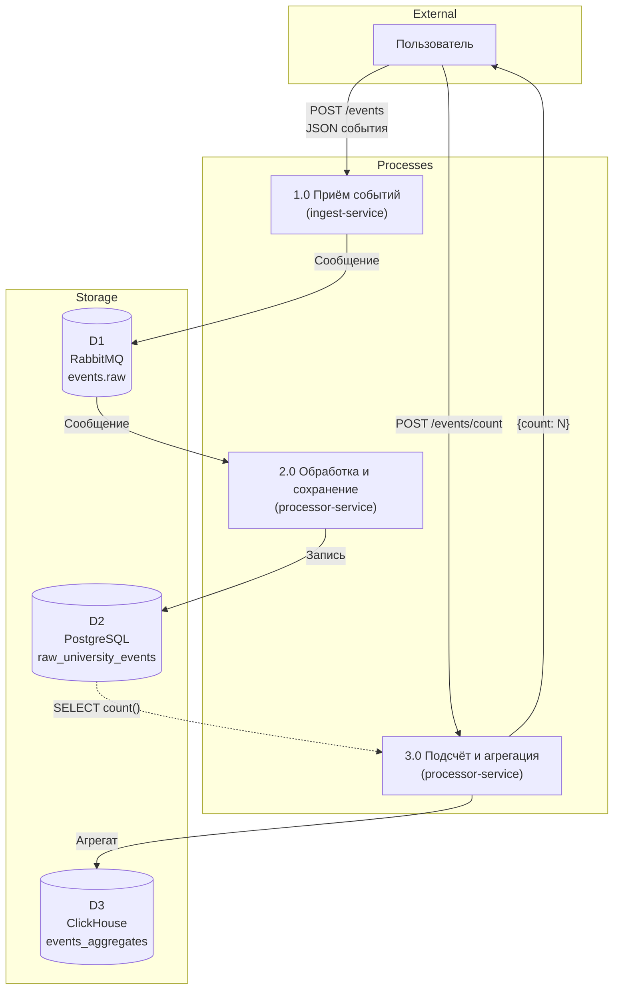

# DFD-диаграмма (нотация Гейна-Сарсона)

**Система обработки событий университета**

---

## Контекстная диаграмма (уровень 0)

---

## Диаграмма 1 уровня

**Потоки данных:**

| № | От | К | Данные |
|---|----|---|--------|
| 1 | Пользователь | 1.0 | POST /events, JSON (ФИО, дисциплина, аудитория, дата) |
| 2 | 1.0 | D1 | Сообщение в очередь RabbitMQ |
| 3 | D1 | 2.0 | Сообщение из очереди |
| 4 | 2.0 | D2 | Запись в PostgreSQL |
| 5 | Пользователь | 3.0 | POST /events/count |
| 6 | D2 | 3.0 | Запрос count в PostgreSQL |
| 7 | 3.0 | D3 | Вставка (дата, количество) в ClickHouse |
| 8 | 3.0 | Пользователь | Ответ {count} |

---

## Мини-спецификации

### Процесс 1.0 «Приём событий»

| Поле | Описание |
|------|----------|
| **Вход** | JSON-событие: fio_prepodavatelya, disciplina, auditoriya, data_sobytiya |
| **Выход** | Сообщение в очередь D1 (RabbitMQ, events.raw) |
| **Логика** | Принять POST /api/v1/events, валидировать тело запроса, сериализовать в сообщение, отправить в RabbitMQ. HTTP-ответ 202 Accepted. |

### Процесс 2.0 «Обработка и сохранение»

| Поле | Описание |
|------|----------|
| **Вход** | Сообщения из D1 (очередь events.raw) |
| **Выход** | Записи в D2 (PostgreSQL, raw_university_events) |
| **Логика** | Слушать очередь, десериализовать сообщение, вставить строку в таблицу raw_university_events (id, fio_prepodavatelya, disciplina, auditoriya, data_sobytiya). ACK после успешной записи. |

### Процесс 3.0 «Подсчёт и агрегация»

| Поле | Описание |
|------|----------|
| **Вход** | POST /api/v1/events/count от пользователя; чтение count из D2 |
| **Выход** | Агрегат (data_vremya_zapisi, kolichestvo_zapisey) в D3; JSON {count} пользователю |
| **Логика** | По запросу: SELECT count(*) FROM raw_university_events; INSERT в events_aggregates (текущее время, count); вернуть {count: N} в ответе. |
