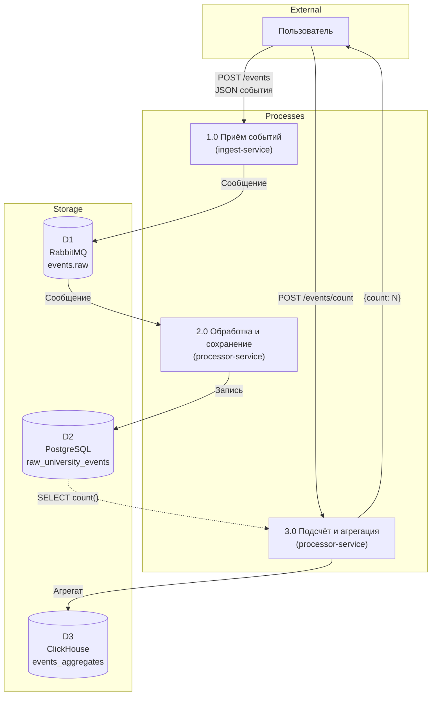

# DFD-диаграмма (нотация Гейна-Сарсона)

**Система обработки событий университета**

---

## Диаграмма 1 уровня

**Потоки данных:**

| № | От | К | Данные |
|---|----|---|--------|
| 1 | Пользователь | 1.0 | POST /events, JSON (ФИО, дисциплина, аудитория, дата) |
| 2 | 1.0 | D1 | Сообщение в очередь RabbitMQ |
| 3 | D1 | 2.0 | Сообщение из очереди |
| 4 | 2.0 | D2 | Запись в PostgreSQL |
| 5 | Пользователь | 3.0 | POST /events/count |
| 6 | D2 | 3.0 | Запрос count в PostgreSQL |
| 7 | 3.0 | D3 | Вставка (дата, количество) в ClickHouse |
| 8 | 3.0 | Пользователь | Ответ {count} |
