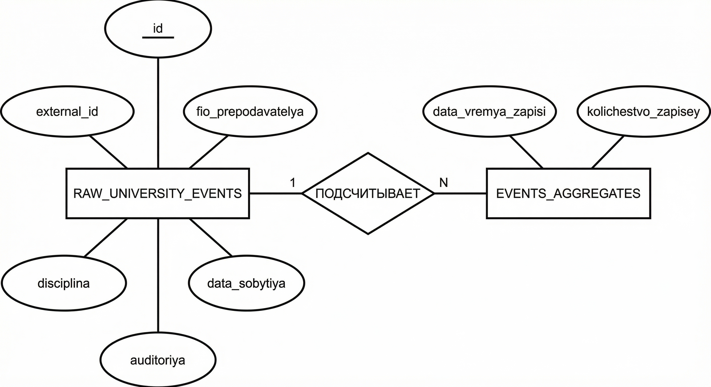
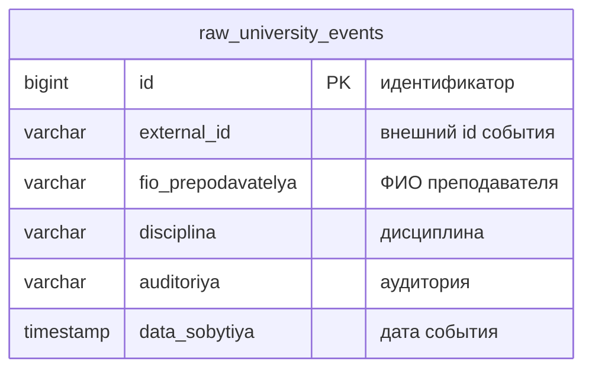
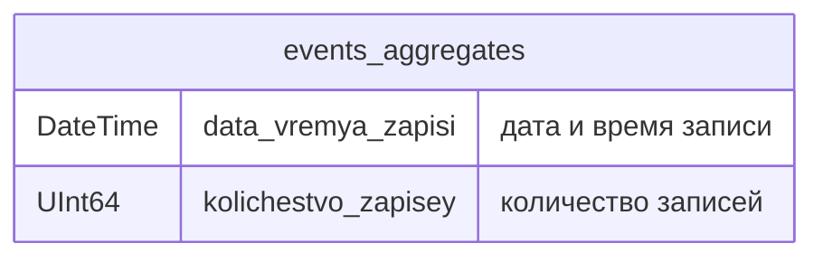
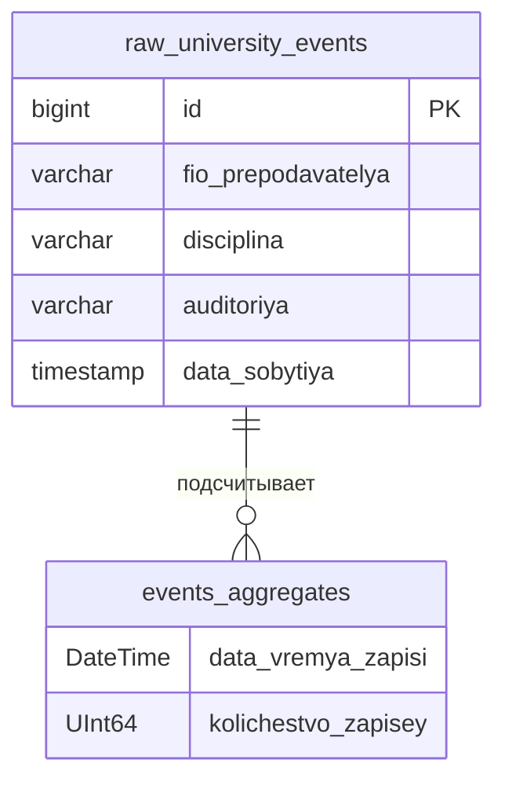

# ERD-диаграммы (нотация Чена)

Хранилища D2 и D3 из DFD.

## Диаграмма в нотации Чена

---

## Хранилище D2: raw_university_events (PostgreSQL)

Таблица сырых событий университета.

### Атрибуты сущности raw_university_events (сырые_события_университета)

| Атрибут | Тип | Описание |
|---------|-----|----------|
| id | BIGSERIAL, PK | Идентификатор записи |
| external_id | VARCHAR(255) | Идентификатор из источника |
| fio_prepodavatelya | VARCHAR(500) | ФИО преподавателя |
| disciplina | VARCHAR(255) | Дисциплина |
| auditoriya | VARCHAR(100) | Аудитория |
| data_sobytiya | TIMESTAMP | Дата события |

---

## Хранилище D3: events_aggregates (ClickHouse)

Таблица агрегатов событий университета.

### Атрибуты сущности events_aggregates (агрегаты_событий_университета)

| Атрибут | Тип | Описание |
|---------|-----|----------|
| data_vremya_zapisi | DateTime | Дата и время записи агрегата |
| kolichestvo_zapisey | UInt64 | Количество записей в raw_university_events на момент записи |

---

## Логическая связь между хранилищами

Агрегаты формируются путём подсчёта записей в raw_university_events. Прямой внешний ключ отсутствует; связь реализуется в процессе 3.0 (подсчёт и агрегация).

---

## Нотация Чена (текстовое представление)

**Сущность RAW_UNIVERSITY_EVENTS:**
- <u>id</u> (первичный ключ)
- external_id
- fio_prepodavatelya
- disciplina
- auditoriya
- data_sobytiya

**Сущность EVENTS_AGGREGATES:**
- data_vremya_zapisi
- kolichestvo_zapisey

**Связь ПОДСЧИТЫВАЕТ (1:N):** Один снимок агрегата соответствует одному значению COUNT по raw_university_events.
