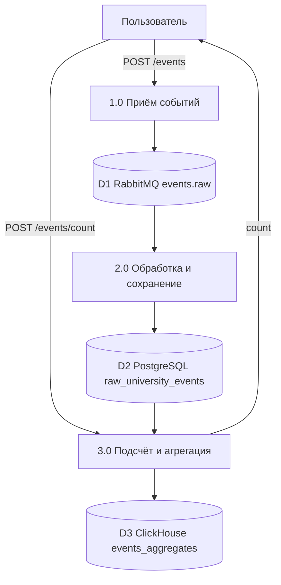

# Описание программы

**По ГОСТ 19.402-78**

Самыловских А.И., группа __________, лабораторная работа №3

---

## 1. Общие сведения

**Обозначение:** Система обработки событий университета

**Наименование:**
- ingest-service — сервис приёма событий
- processor-service — сервис обработки и агрегации

**Программное обеспечение:** Java 17, Spring Boot 3.2, Maven 3.9

**Языки программирования:** Java

---

## 2. Функциональное назначение

**Класс решаемых задач:** учёт событий университета (занятия, дисциплины, преподаватели, аудитории) и формирование агрегированной статистики.

**Назначение:**
- Приём событий через REST API и передача в очередь сообщений
- Сохранение сырых событий в реляционную БД
- Подсчёт количества записей и запись агрегатов в колоночную БД

**Ограничения:**
- События обрабатываются асинхронно
- Агрегация выполняется по запросу (on-demand)

---

## 3. Описание логической структуры

### 3.1 DFD-диаграмма

Подробности — в [dfd.md](dfd.md).

### 3.2 Алгоритм

1. ingest-service принимает POST /api/v1/events, валидирует JSON, сериализует и отправляет в RabbitMQ (очередь events.raw).
2. processor-service подписан на events.raw; при получении сообщения парсит JSON, создаёт сущность RawUniversityEvent и сохраняет в PostgreSQL.
3. При POST /api/v1/events/count processor-service выполняет count() по таблице raw_university_events, записывает (текущее время, count) в ClickHouse и возвращает count клиенту.

---

## 4. Используемые технические средства

- Платформа: Docker
- СУБД: PostgreSQL 16, ClickHouse 24
- Брокер сообщений: RabbitMQ 3
- Среда выполнения: JVM 17 (Eclipse Temurin)

---

## 5. Вызов и загрузка

**Способ вызова:** `docker compose up --build` из корня репозитория.

**Порты:**
- ingest-service: 8081
- processor-service: 8082
- RabbitMQ Management: 15672

**Использование памяти:** по умолчанию JVM heap (настраивается через переменные окружения при необходимости).

---

## 6. Входные данные

**POST /api/v1/events** (ingest-service):

| Поле | Тип | Обязательно |
|------|-----|-------------|
| id | string | нет (генерируется) |
| fio_prepodavatelya | string | да |
| disciplina | string | да |
| auditoriya | string | да |
| data_sobytiya | ISO-8601 | да |

**POST /api/v1/events/count** (processor-service): тело пустое.

---

## 7. Выходные данные

**POST /api/v1/events:** `{"status":"accepted","id":"<uuid>"}`

**POST /api/v1/events/count:** `{"count":<число>}`

---

Для сдачи: экспортировать в docx/pdf. Имя файла: `ФИО_группа_лаб3`.
