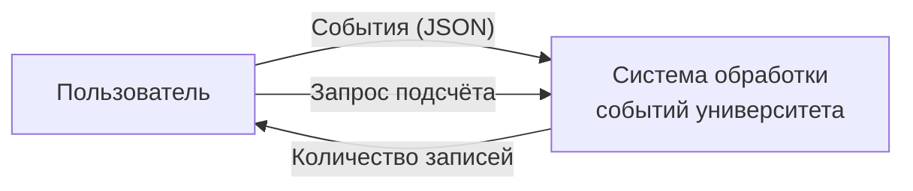
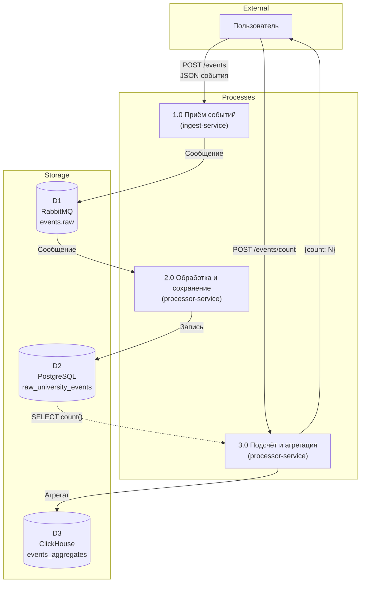

# Техническое задание

**По ГОСТ 19.201-78**

Самыловских А.И., ССПО-П-ИСиТ-нетология-2

---

## 1. Предисловие

**Наименование:** Система обработки событий университета

**Сфера применения:** учёт событий учебного процесса (занятия, дисциплины, преподаватели, аудитории) и формирование агрегированной статистики для отчётности.

---

## 2. Основание для разработки

Учебный проект в рамках курса «Сертификация и стандартизация ПО». Разработка на основе лабораторных работ №1 (DFD) и №2 (ERD).

---

## 3. Цель разработки

Автоматизация учёта событий университета, накопление сырых данных в реляционной БД и формирование агрегатов в колоночной БД для аналитических запросов.

---

## 4. Требования к программе

### 4.1 Функциональные требования

- Приём событий по REST API (POST /api/v1/events)
- Отправка событий в очередь RabbitMQ (events.raw)
- Асинхронное сохранение событий в PostgreSQL (таблица raw_university_events)
- Подсчёт количества записей по запросу (POST /api/v1/events/count)
- Запись агрегатов (дата/время, количество) в ClickHouse (таблица events_aggregates)

### 4.2 Эксплуатационные требования

- Запуск через Docker Compose
- Настройка подключений через переменные окружения (URL БД, RabbitMQ, ClickHouse)

### 4.3 Технические требования

- Java 17
- Spring Boot 3.2
- PostgreSQL 16
- ClickHouse 24
- RabbitMQ 3
- Maven 3.9

---

## 5. Диаграммы

DFD и ERD-диаграммы приведены в приложении А.

---

## Приложение А. Диаграммы

### А.1 DFD (нотация Гейна-Сарсона)

**Контекстная диаграмма (уровень 0):**

**Диаграмма 1 уровня:**

**Диаграммы 2 уровня и мини-спецификации** — в [dfd.md](dfd.md).

### А.2 ERD (нотация Чена)

### А.3 Описание атрибутов хранилищ

**raw_university_events (PostgreSQL):**

| Атрибут | Тип | Описание |
|---------|-----|----------|
| id | BIGSERIAL, PK | Идентификатор |
| external_id | VARCHAR(255) | Внешний id события |
| fio_prepodavatelya | VARCHAR(500) | ФИО преподавателя |
| disciplina | VARCHAR(255) | Дисциплина |
| auditoriya | VARCHAR(100) | Аудитория |
| data_sobytiya | TIMESTAMP | Дата события |

**events_aggregates (ClickHouse):**

| Атрибут | Тип | Описание |
|---------|-----|----------|
| data_vremya_zapisi | DateTime | Дата и время записи |
| kolichestvo_zapisey | UInt64 | Количество записей |

Агрегаты формируются подсчётом записей в raw_university_events; прямая ссылка (FK) не используется.
